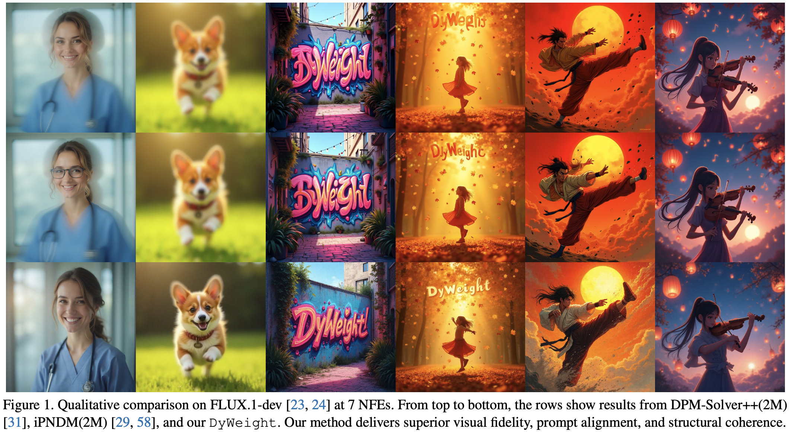

<p align="center">
  <h1 align="center">
  DyWeight: Dynamic Gradient Weighting for Few-Step Diffusion Sampling
  </h1>
  
</p>

## ✨ Highlights

- Supports both classic benchmarks and modern latent T2I models (**Stable Diffusion / FLUX.1-dev**)

- Lightweight learned solver weights (no modification to base diffusion model)

## 📰 News and Update
- **[2026.3.12]** 🔥 We release the code.

## Introduction
Diffusion Models (DMs) have achieved state-of-the-art generative performance across multiple modalities, yet their sampling process remains prohibitively slow due to the need for hundreds of number of function evaluations (NFEs). Recent progress in multi-step ODE solvers has greatly improved efficiency by reusing historical gradients, but existing methods rely on handcrafted coefficients that fail to adapt to the non-stationary dynamics of diffusion sampling. To address this limitation, we propose *Dy*namic Gradient *Weight*ing (DyWeight), a lightweight, learning-based multi-step solver that adaptively re-weights historical gradients at each timestep. Through a teacher–student distillation framework, **DyWeight** learns time-varying weighting parameters that capture the evolving denoising behavior without modifying the diffusion model itself. Moreover, we introduce a time calibration mechanism, comprising time shifting and time scaling, to dynamically align the solver’s numerical trajectory with the model’s internal denoising dynamics under large integration steps. Extensive experiments on CIFAR-10, FFHQ, AFHQv2, ImageNet64, LSUN-Bedroom, Stable Diffusion and FLUX.1-dev demonstrate that **DyWeight** achieves superior visual fidelity and stability with significantly fewer function evaluations, establishing a new state-of-the-art among efficient diffusion solvers.

## 🎯 How to Use

Official implementation of DyWeight, a learned sampling method for diffusion models that dynamically predicts optimal solver weights during generation.

**Complete workflow**: The full pipeline (training, sampling, and FID evaluation) with recommended configurations is provided in [`run.sh`](run.sh). You can find all commands there.

We provide support for large-scale latent diffusion models to validate the transferability and practical effectiveness of DyWeight.  
For FLUX.1-dev usage details (setup, scripts, and notes), please refer to [`dyweight_flux/flux.md`](dyweight_flux/flux.md).

### Installation

```bash
conda env create -f environment.yml
conda activate DyWeight
```

### Project Structure (Recommended)

We recommend organizing project files into the following directory structure for training, sampling, and evaluation:

```
DyWeight/
├── exps/                    # Trained DyWeight predictor checkpoints (5-digit experiment IDs, e.g., 00000-cifar10-...)
├── src/                     # Pre-trained diffusion models (organized by dataset_name; auto-downloaded on first run)
│   ├── cifar10/
│   ├── ffhq/
│   ├── imagenet64/
│   ├── lsun_bedroom_ldm/
│   └── ...
├── ref/                     # FID reference statistics (.npz) for calc evaluation
├── samples/                 # Generated samples (organized by dataset/solver_nfe)
└── ...
```

- **exps**: Default output directory for `train.py`; `--predictor_path=00000` resolves here.
- **src**: Pre-trained diffusion models are downloaded to `./src/<dataset_name>/` via `torch_utils/download_util.py`.
- **ref**: Store FID reference `.npz` files here.

## Usage

### Training

Train DyWeight predictor (see `run.sh` for more examples). Pre-trained diffusion models are automatically downloaded to `src/` on first run.

```bash
# CIFAR-10 (NFE=3, requires 2 GPUs)
OMP_NUM_THREADS=1 torchrun --standalone --nproc_per_node=2 train.py \
  --dataset_name=cifar10 \
  --batch=16 \
  --total_kimg=10 \
  --sampler_stu=dyweight --sampler_tea=ipndm \
  --num_steps=5 --teacher_steps=35 \
  --afs=True --max_history_steps=3 \
  --schedule_type=polynomial --schedule_rho=7 \
  --loss_type=inception \
  --lr=3e-2 --use_cosine_annealing=True
```

**Note**: NFE = (num_steps - 1) - 1 if `afs=True`, else (num_steps - 1)

### Sampling

Generate 50k samples for FID evaluation:

```bash
# Using trained predictor (saved in ./exps/)
OMP_NUM_THREADS=1 torchrun --standalone --nproc_per_node=2 sample.py \
  --predictor_path=00000 \
  --batch=128 \
  --seeds=0-49999 \
  --solver=dyweight
```

### Evaluation

Compute FID score (requires 50k generated samples first, 30k for MS-COCO dataset):

```bash
python -m eval.fid calc \
  --images=samples/cifar10/dyweight_nfe3 \
  --ref=ref/cifar10-32x32.npz
```

**FID Reference Statistics**: Point `--ref` to a local `.npz` file in `ref/`, or use the following reference statistics:

- [NVIDIA EDM fid-refs](https://nvlabs-fi-cdn.nvidia.com/edm/fid-refs/) — CIFAR-10, FFHQ, AFHQv2, ImageNet-64, etc.
- [AMED FID Statistics](https://drive.google.com/drive/folders/1f8qf5qtUewCdDrkExK_Tk5-qC-fNPKpL) — Extended references including LDM, MS-COCO, and more.

## Pre-trained Diffusion Models

Pre-trained diffusion models are automatically downloaded to `src/<dataset_name>/` during training and sampling. Alternatively, download manually and place them in the corresponding directories.

| Codebase | dataset_name | Resolution | Pre-trained Model | Link |
|----------|--------------|-------------|-------------------|------|
| EDM | cifar10 | 32×32 | edm-cifar10-32x32-uncond-vp.pkl | [Download](https://nvlabs-fi-cdn.nvidia.com/edm/pretrained/edm-cifar10-32x32-uncond-vp.pkl) |
| EDM | ffhq | 64×64 | edm-ffhq-64x64-uncond-vp.pkl | [Download](https://nvlabs-fi-cdn.nvidia.com/edm/pretrained/edm-ffhq-64x64-uncond-vp.pkl) |
| EDM | afhqv2 | 64×64 | edm-afhqv2-64x64-uncond-vp.pkl | [Download](https://nvlabs-fi-cdn.nvidia.com/edm/pretrained/edm-afhqv2-64x64-uncond-vp.pkl) |
| EDM | imagenet64 | 64×64 | edm-imagenet-64x64-cond-adm.pkl | [Download](https://nvlabs-fi-cdn.nvidia.com/edm/pretrained/edm-imagenet-64x64-cond-adm.pkl) |
| Consistency | lsun_bedroom | 256×256 | edm_bedroom256_ema.pt | [Download](https://openaipublic.blob.core.windows.net/consistency/edm_bedroom256_ema.pt) |
| ADM | imagenet256 | 256×256 | 256x256_diffusion.pt + 256x256_classifier.pt | [diffusion](https://openaipublic.blob.core.windows.net/diffusion/jul-2021/256x256_diffusion.pt) · [classifier](https://openaipublic.blob.core.windows.net/diffusion/jul-2021/256x256_classifier.pt) |
| LDM | lsun_bedroom_ldm | 256×256 | lsun_bedrooms.zip | [Download](https://ommer-lab.com/files/latent-diffusion/lsun_bedrooms.zip) |
| LDM | ffhq_ldm | 256×256 | ffhq.zip | [Download](https://ommer-lab.com/files/latent-diffusion/ffhq.zip) |
| LDM | vq-f4 | - | vq-f4.zip (LDM first-stage model) | [Download](https://ommer-lab.com/files/latent-diffusion/vq-f4.zip) |
| Stable Diffusion | ms_coco | 512×512 | v1-5-pruned-emaonly.ckpt | [Download](https://huggingface.co/runwayml/stable-diffusion-v1-5/resolve/main/v1-5-pruned-emaonly.ckpt) |
| - | prompts | - | MS-COCO_val2014_30k_captions.csv | [Download](https://github.com/boomb0om/text2image-benchmark/releases/download/v0.0.1/MS-COCO_val2014_30k_captions.csv) |

## Supported datasets and compute requirements

| Setup | Category | Typical Resolution | Recommended GPU (VRAM) |
|---|---|---|---|
| CIFAR-10 | Pixel-space benchmark | 32×32 | RTX 4090 (24GB) |
| FFHQ | Pixel-space benchmark | 64×64 / 256×256 (depending on config) | RTX 4090 (24GB) |
| AFHQv2 | Pixel-space benchmark | 64×64 / 256×256 (depending on config) | RTX 4090 (24GB) |
| ImageNet-64 | Pixel-space benchmark | 64×64 | RTX 4090 (24GB) |
| LSUN Bedroom (LDM) | Latent diffusion benchmark | latent space (typically 256×256 image equivalent) | A100 / H100 (80GB) | 
| Stable Diffusion (MS-COCO) | Large-scale latent T2I | 512×512 (typical) | A100 / H100 (80GB) |
| FLUX.1-dev (MS-COCO) | Large-scale latent T2I | 512×512 / 1024×1024 (depending on setup) | A100 / H100 (80GB) |

Adjust `--batch-gpu` according to available VRAM.

## Acknowledgments

This repository is built upon the following codebases. We thank the authors for their excellent work and open-source contributions:

- [**EDM**](https://github.com/NVlabs/edm) — Elucidating the Design Space of Diffusion-Based Generative Models
- [**diff-sampler**](https://github.com/zju-pi/diff-sampler/) (AMED) — Open-source toolbox for fast sampling of diffusion models
- [**EPD**](https://github.com/BeierZhu/EPD/tree/EPD-Solver) — Distilling parallel gradients for fast ODE solvers of diffusion models

<!-- ## Supported Datasets

- CIFAR-10
- FFHQ
- AFHQv2  
- ImageNet-64
- LSUN Bedroom (LDM)
- MS-COCO (Stable Diffusion, FLUX.1-dev)

## Hardware Requirements

- **RTX 4090**: CIFAR-10, FFHQ, AFHQv2, ImageNet-64
- **A100/H100**: LSUN Bedroom (LDM), Stable Diffusion, FLUX.1-dev

Adjust `--batch-gpu` according to your GPU memory. -->
